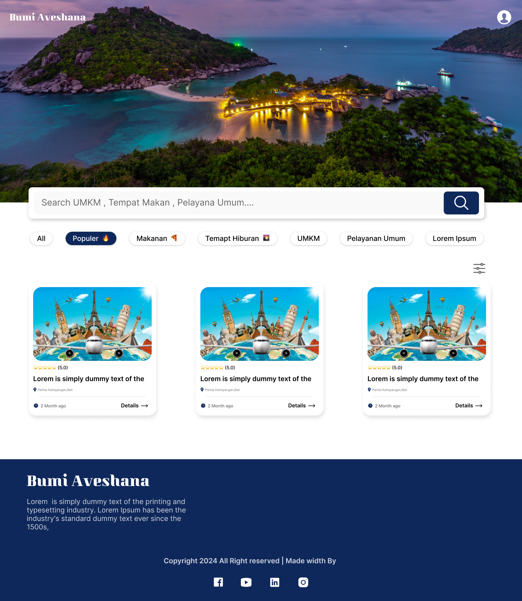
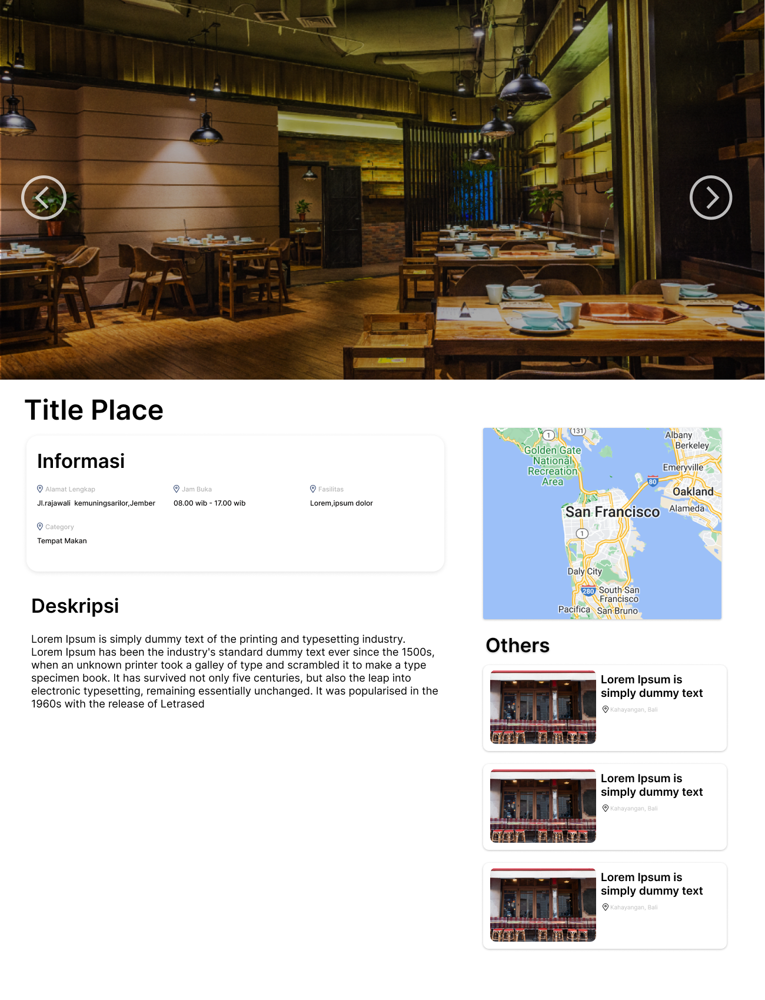
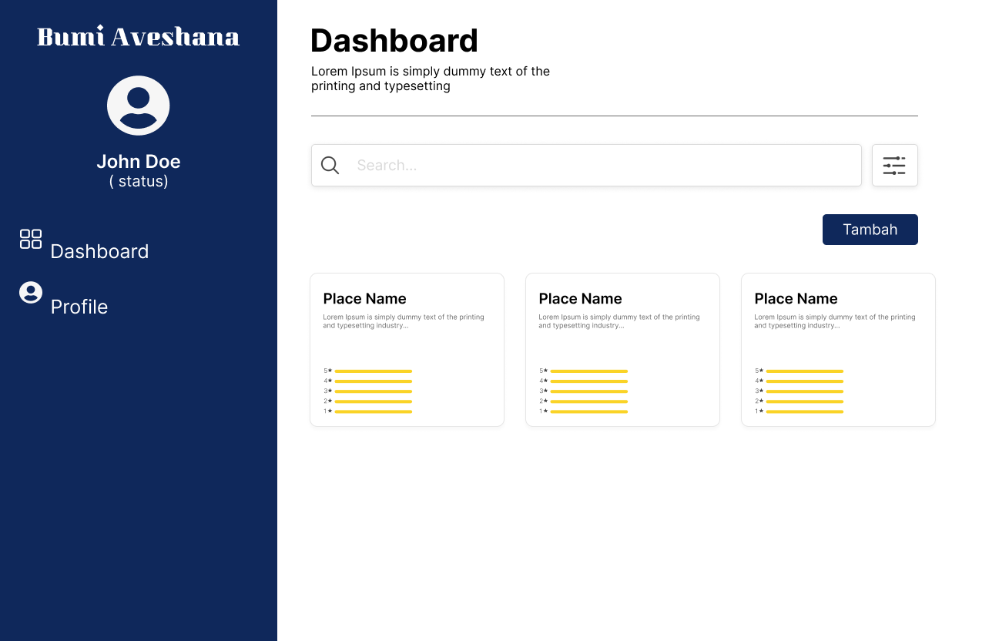
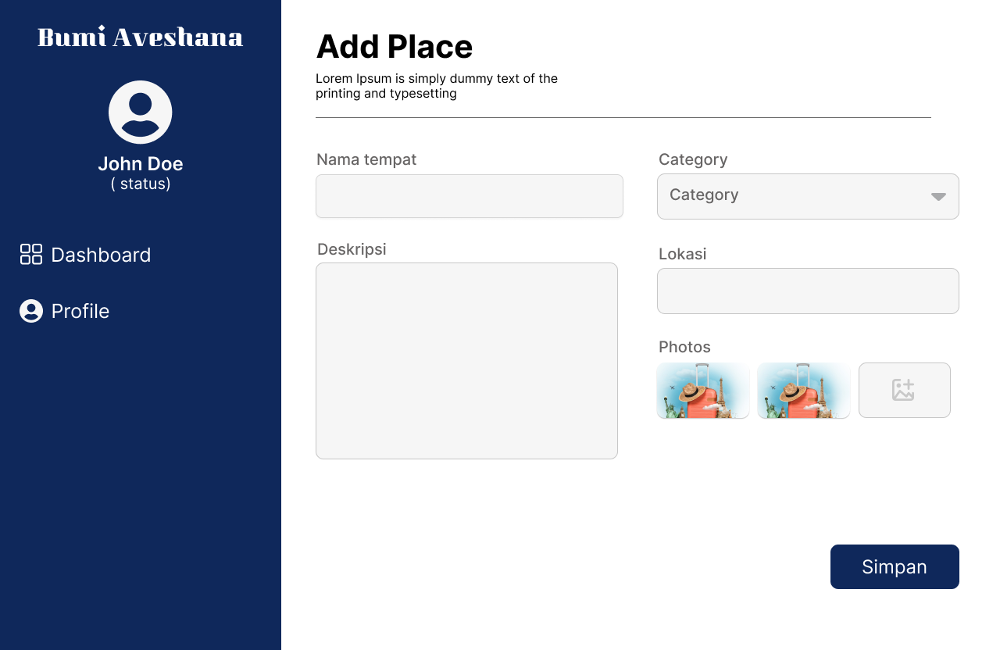
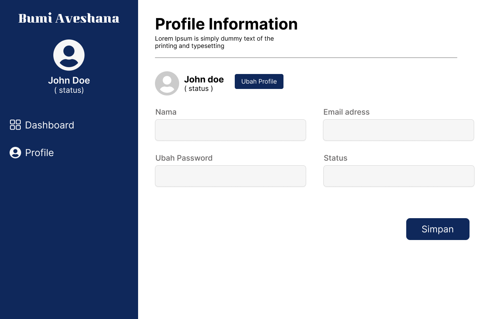

# BHUMI AVESHANA - CAPSTONE SUBMISSION
## Identity
**ID Group:** C242-PR585  
**Machine Learning Members:**  
- Akbar Wahyu Pradana (M200B4KY0281)
- Heparia Arum Ndaru Ramdhani (M312B4KX1769)
  
**Cloud Computing Members:**
- Abdul Mukti (C285B4KY0030)
- Imam Farrel Rayhandita Soetardjo Prabowo (C011B4KY1957)
- Suwito Muda Karana Indra Waspada (C193B4KY4238)
- Wisnu Wardana (C315B4KY4507)

## Documents
- **Presentation Slide:** [View on Canva](https://www.canva.com/design/DAGYzU7wzoI/akGVQZ1NODitYNSP7D3ETg/view?utm_content=DAGYzU7wzoI&utm_campaign=designshare&utm_medium=link2&utm_source=uniquelinks&utlId=h94d3207000)  
- **Project Brief:** [View on Google Docs](https://docs.google.com/document/d/1L6lza7Tz8e08b3eak6Y256SprdvgZq14UUk29Ctkge4/edit?tab=t.0)  
- **Project Plan:** [View on Google Drive](https://drive.google.com/file/d/1fFg-JEXtL4GbvLnPy8mG44Bho3DRvqkX/view?usp=sharing)

## Machine Learning
**Collaborative Filtering Based on Item and User Features:** This model leverages both item and user attributes to enhance the accuracy of recommendations. The detailed implementation and comprehensive analysis can be found in the accompanying notebook (.ipnyb) in Machine Learning Folder.

**TensorFlow.js Conversion:** To ensure compatibility with web-based applications, the model has been converted to TensorFlow.js. This allows seamless deployment and interaction within a browser environment, providing broader accessibility and ease of use.

## Cloud Computing

## Website Bhumi Aveshana

### Home Page

### Detail Page

### Dashboard Page

### Add Page

### Profile Page

### Login Page

### Register Page

